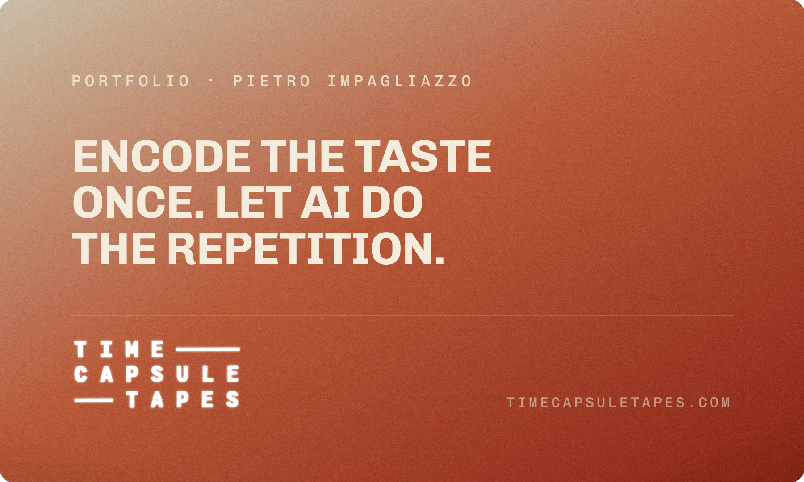
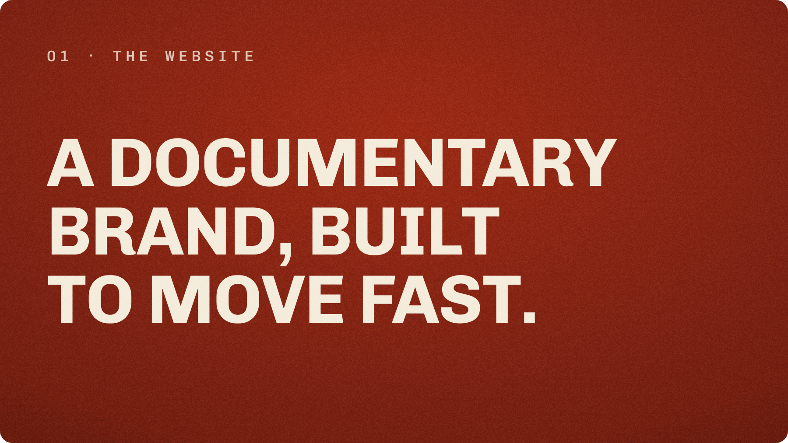
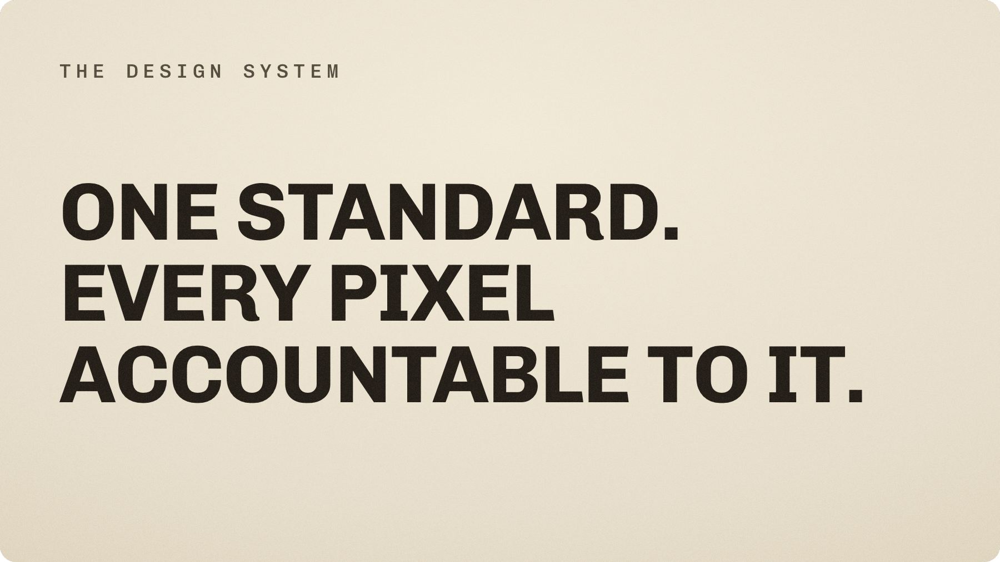
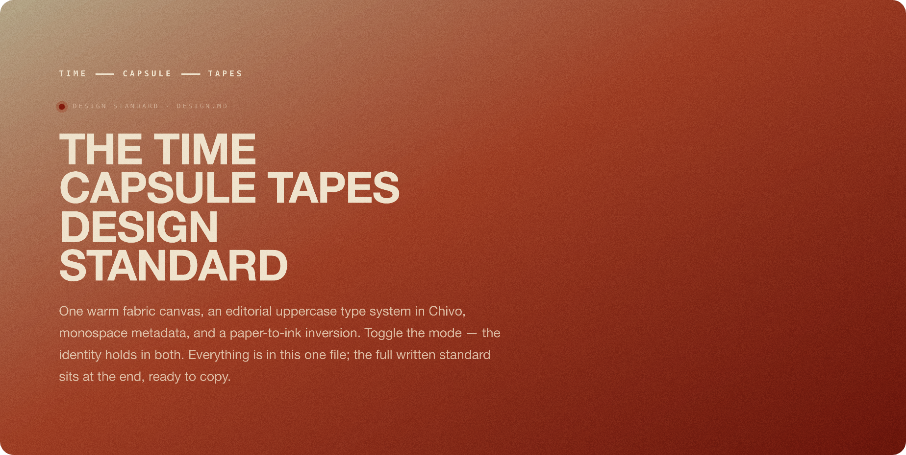
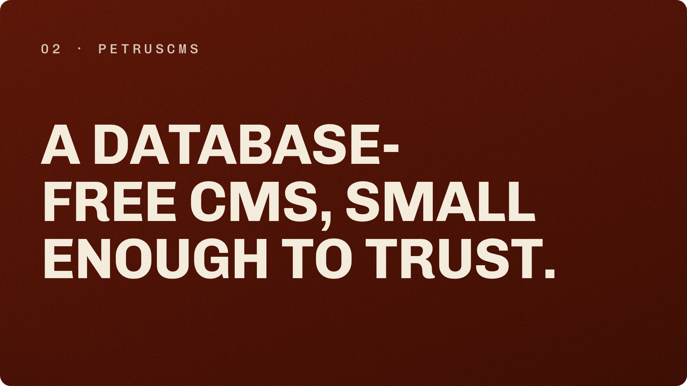
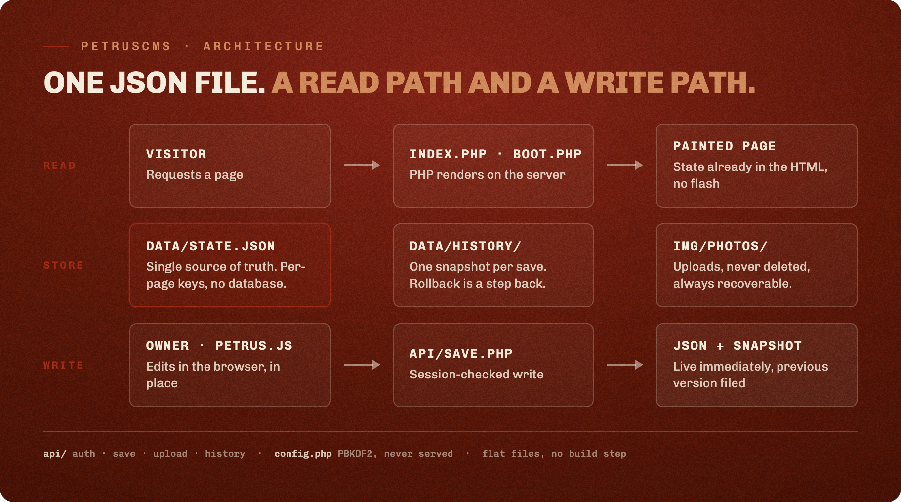
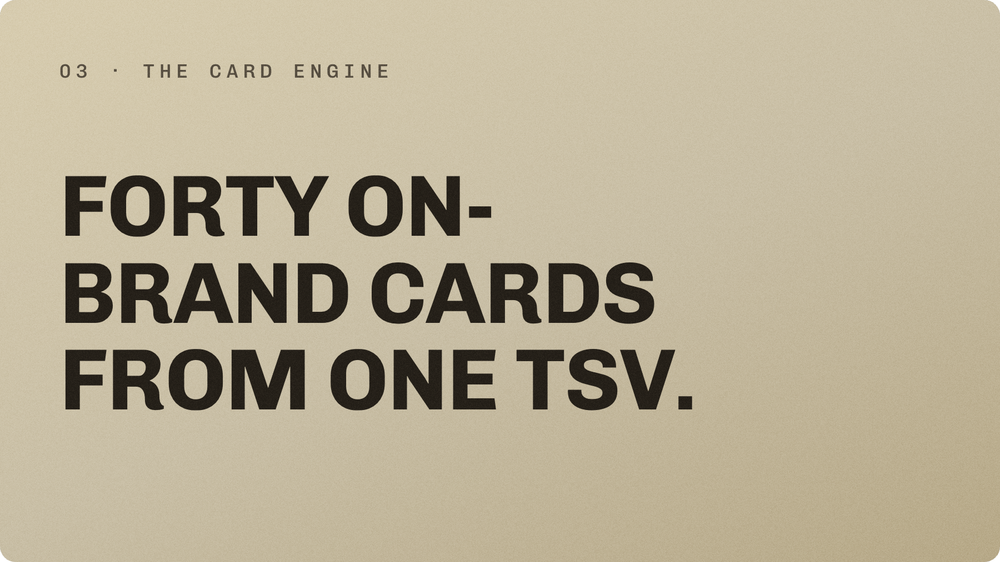
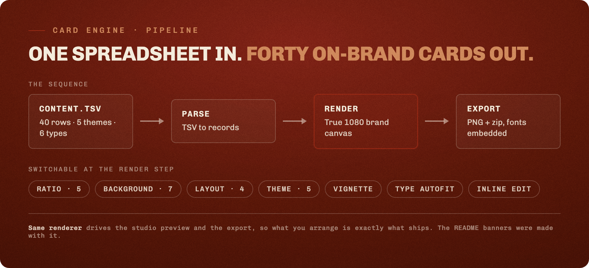
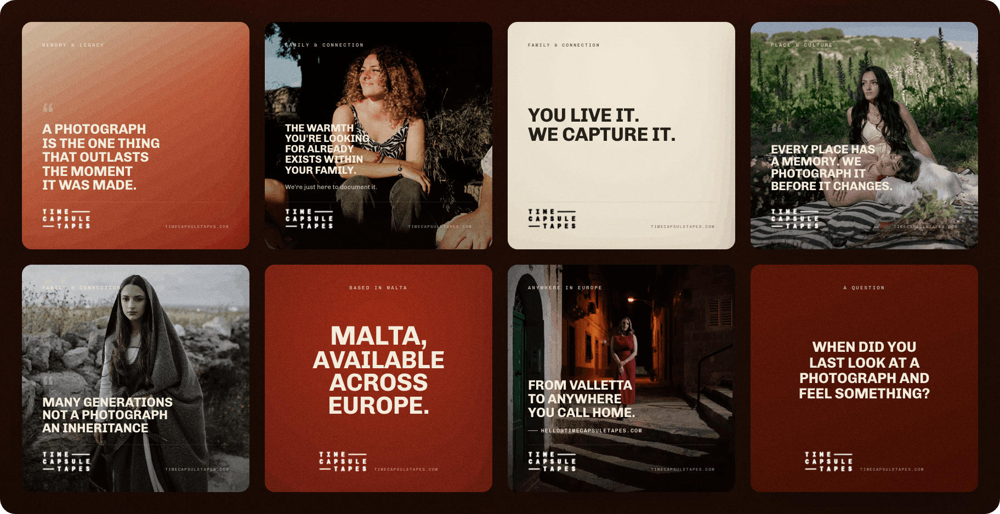

<p align="center">
  
</p>

<p align="center">
  <strong>Time Capsule Tapes</strong> is a documentary photography studio in Malta.<br>
  This repository is the design work behind it, gathered in one place.
</p>

<p align="center">
  <a href="https://timecapsuletapes.com">Live site</a>
  &nbsp;·&nbsp;
  <a href="docs/design-standard.html">Design standard</a>
  &nbsp;·&nbsp;
  <a href="cards/index.html">Card studio</a>
</p>

---

## The through-line

Three bodies of work sit in this repository. They share one method.

Write the taste down once, with enough precision that a machine can carry it. Then spend human attention only on the decisions that actually need a person. A photographer should be choosing pictures, not nudging the same margin across twenty files.

The method looks the same in all three pieces. A small, strict system at the centre. Everything else generated from it. The website, the content tool, and the editing layer were each built so that changing one rule updates everything downstream. The banners on this page make the point literally. They were rendered from the brand's own stylesheet, so they are not a picture of the system. They are the system, run once more.

What that buys is pace. When the rules live in one place, a new section, a new card, or a whole new colour mode is a small edit instead of a long afternoon. The studio could move quickly without the work drifting out of character.

---

## What is inside

- **The website.** A documentary brand that reads as a warm archive caught on film.
- **The design system.** One file that holds every colour, type and motion decision, with a copy-ready standard at the end.
- **PetrusCMS.** A database-free content manager built into the site, so the owner edits in place and nothing depends on a platform.
- **The card engine.** A studio that turns one spreadsheet into print-ready social cards in every format the brand uses.

---

## 1. The website

<p align="center">
  
</p>

The site is built to feel like a warm archive on film rather than a tech product. The canvas is a warm fabric gradient over a deep red, never flat black. Fine grain sits over everything at soft light. Headlines are set in Chivo, uppercase and tight. Metadata reads like a contact sheet in Chivo Mono. One oxide red does all the accenting.

The move a visitor actually feels is the background. Full-bleed photographs cross-fade from section to section as you scroll, and the type recolours with them, warm paper over the dark sections and warm ink over the limestone ones. The identity holds in both modes because only the text tokens change. The grain, the vignette and the layout stay put.

It moved quickly because the look was written down before it was built. Spacing, type scale, easing and the accent treatment were fixed once, so each new section was an assembly job, not a fresh negotiation. The full standard is the next section.

**Live at [timecapsuletapes.com](https://timecapsuletapes.com).**

---

## The design system

<p align="center">
  
</p>

The whole brand lives in a single page. It names the exact palette and tokens, the two type families and their scale, spacing, the signature accent, the motion easing, and the anti-patterns to avoid. At the end it carries the written standard as copyable text, so a designer or an assistant can lift the rules verbatim instead of guessing from screenshots.

<p align="center">
  
</p>

This is the part that makes the pace possible. The colours and type in the banners above were pulled from these exact values. Change a token in the standard and the next render inherits it. The standard is the source, the rest is output.

The brand is dual by construction. Most of the site is warm paper over the dark fabric gradient; the limestone sections invert to warm ink. Only the text tokens swap. The grain, the vignette and the layout never move. Here is one section in both modes, split down the diagonal:

<p align="center">
  
</p>

The page ends with the whole standard written out as copyable Markdown in a code window. Hand the file to a designer or an assistant and they lift the rules verbatim instead of guessing from screenshots.

<p align="center">
  
</p>

**Open it: [docs/design-standard.html](docs/design-standard.html).** It is one self-contained file with a dark and a limestone mode.

---

## 2. PetrusCMS

<p align="center">
  
</p>

The site needed to be editable by its owner without handing the brand to a heavy platform. So the editing layer is a small content manager called Petrus, built into the site on flat files. No database, no framework, no build step.

<p align="center">
  
</p>

There is one content file at the centre, `state.json`, and it describes everything dynamic on the page. The read path is plain. A visitor asks for a page, PHP renders it on the server with the saved state already in the HTML, so there is no flash of default content. The write path is just as plain. The owner unlocks the page, edits text and photographs in place, and saves. Each save writes the JSON and files the previous version into a history folder, so rolling back is a step backward rather than a restore. Uploaded photographs are never deleted, which means any old version can always point at its images.

Keeping it this small is the point. The moving parts are few and named. The render, the in-browser editor, the handful of endpoints for saving, uploading and history, and the one JSON file they all agree on. There is nothing to provision and nothing to keep patched.

**How it is built: [docs/petruscms.md](docs/petruscms.md).**

---

## 3. The card engine

<p align="center">
  
</p>

Social posting is where a brand usually erodes, one off-template graphic at a time. The card engine removes that drift. It is a studio that reads one spreadsheet and lays out finished cards on the brand's real canvas.

<p align="center">
  
</p>

The content is a single TSV. Forty lines today, across five themes and six card types, from short quotes to questions, field notes and calls to action. The renderer draws each line on a true 1080 pixel canvas and refits the headline so it never overflows. At the render step a few controls switch the output without touching the words: five aspect ratios, seven brand backgrounds, four layouts, a vignette toggle. Export gives a single card or the whole set as a zip, with the fonts embedded so the files look right anywhere.

One row in, every format out. The same renderer drives the studio preview and the export, so what you arrange is exactly what ships. It also produced the banners at the top of each section here, which is the cleanest test of the tool that there is.

<p align="center">
  
</p>

**Try it: [cards/index.html](cards/index.html).** Pick a ratio, a background and a layout, edit any line in place, and export.

---

## Repository

```
.
├── README.md
├── LICENSE
├── cards/                  the card engine (open it in a browser)
│   ├── index.html
│   ├── app.js
│   ├── styles.css
│   ├── content.tsv         the 40 lines that become cards
│   └── media/
└── docs/
    ├── design-standard.html   the full brand standard, one file
    ├── petruscms.md           how the editing layer is built
    └── assets/                rendered banners, diagrams and the card gallery
```

To see the two live tools without cloning, enable GitHub Pages for this repository. The design standard then opens at `…github.io/time-capsule-tapes/docs/design-standard.html` and the card studio at `…github.io/time-capsule-tapes/cards/`.

---

## Colophon

Type is [Chivo](https://fonts.google.com/specimen/Chivo) and [Chivo Mono](https://fonts.google.com/specimen/Chivo+Mono). The accent is oxide red `#9E2A14` on a warm fabric gradient. The banners, diagrams, mode comparison and card gallery in this README were rendered from the brand's own HTML and CSS, then exported to webp. No stock art, no generated imagery.

Design and build by **Pietro Impagliazzo** for Time Capsule Tapes. Documentary family photography, based in Malta, available across Europe. Get in touch at [hello@timecapsuletapes.com](mailto:hello@timecapsuletapes.com).

### Use

The code in this repository is released under the [MIT License](LICENSE). The Time Capsule Tapes name, logo, photographs and written brand are not covered by that licence and remain the property of the studio. Borrow the engineering, not the identity.
